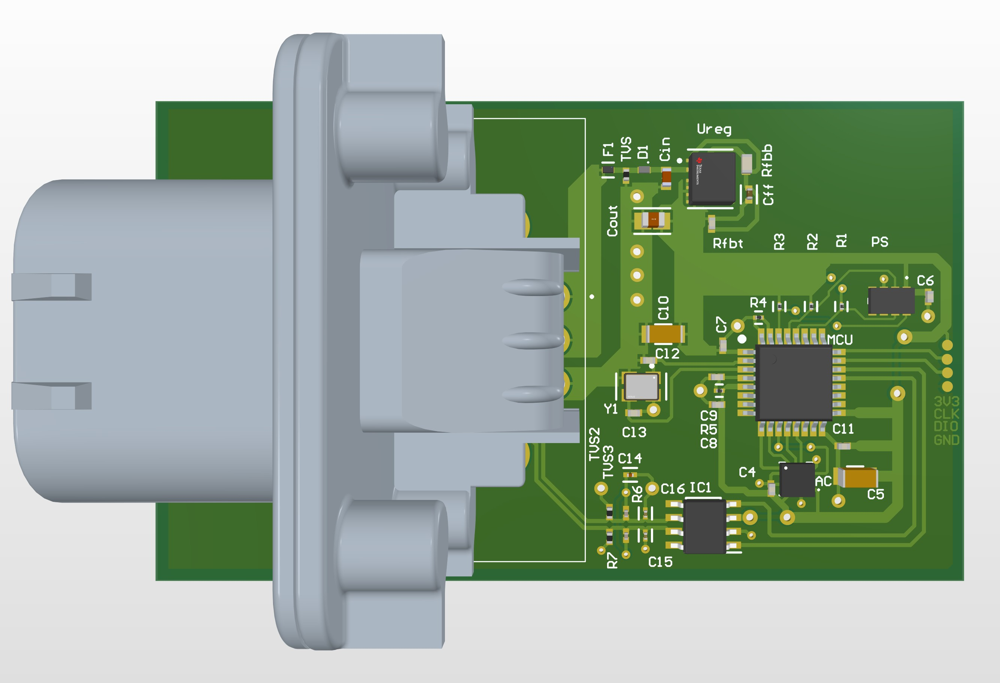
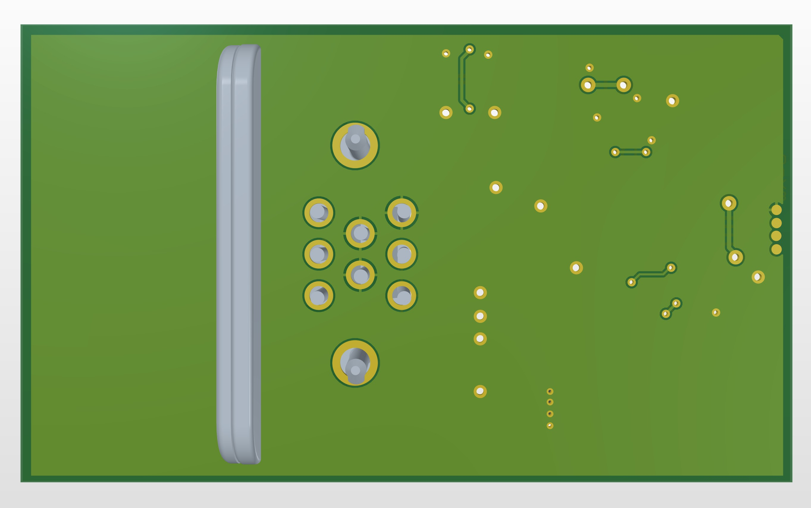

# Overview
Sensor node intended for automotive applications, specifically at all four wheels of a car. Uses a high G accelerometer for sensing shocks, which may be caused by an uneven road surface or vibrations in the car's chassis for example. Also uses a proximity sensor for understanding how the height at each corner changes as the car travels at high speeds, such as barrel roll when turning sharply. Both are connected to an STM32 microcontroller, which communicates with the rest of the vehicle via a CAN transceiver module. An automotive grade 8 pin connector is used for 12V from the car and the CAN bus connection. 12V from the car's low voltage network is run 
through standard automotive protection and buck regulated to 3.3V for the components' power. 

# Key features
- Automotive rated connector
- Powered by 12V from vehicle low voltage bus, buck converted to 3.3V to power components
- Transient voltage, surge, and reverse polarity protection
- Integrated CAN 2.0B with automotive rated transceiver 
- High G accelerometer connected via SPI
- Proximity sensor connected via I2C
- Serial wire debug interface 
