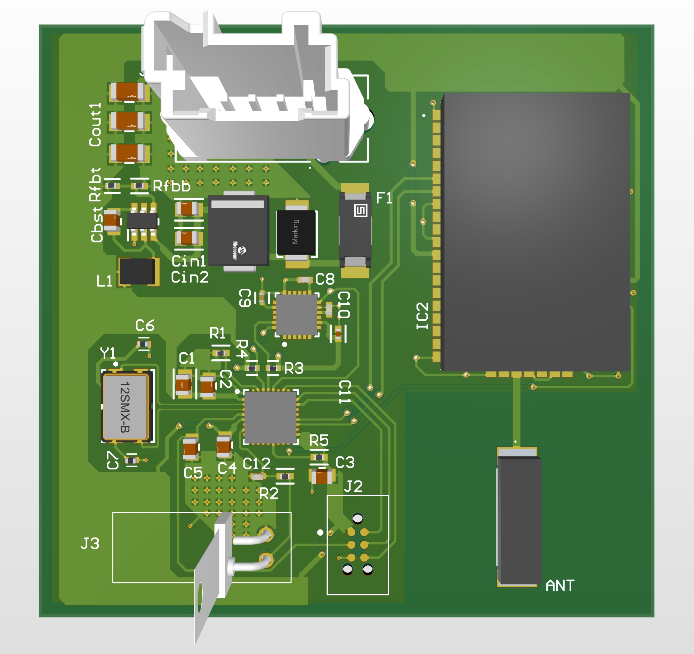
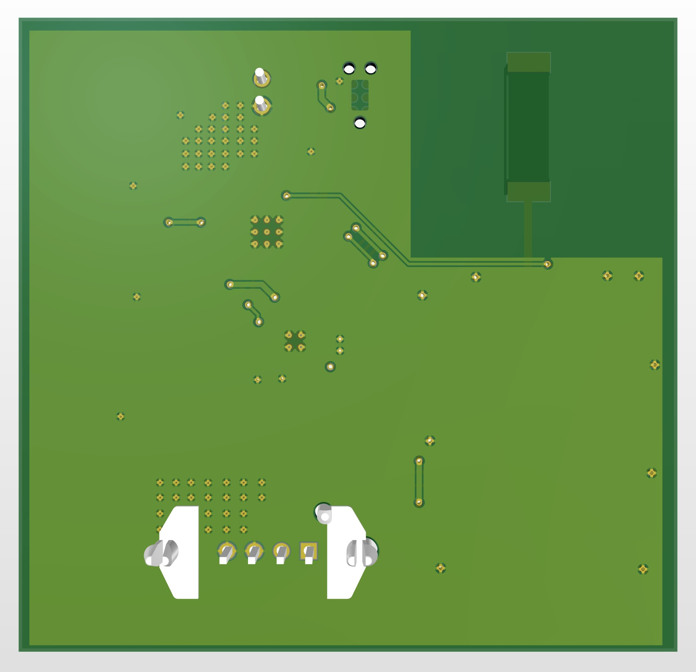

# Overview
A proof of concept shock and motion sensing board project. Uses an STM32 microcontroller connected to the popular MPU-6050 inertial measurement unit (IMU) and analog piezo electric shock sensor. Information transferred via LoRa (RF smart transceiver connected to chip antenna). Powered with 9V DC, passed through automotive grade protection and buck converted to 3.3V.

 

# Key features
- 4 pin connector for 9V
- Efficient buck converter for powering components with 3.3V
- Transient voltage, surge, and reverse polarity protection
- 3 axis IMU
- Piezo electric shock sensor with low pass filter
- Smart RF transceiver module with LoRa capability
- 915 MHz chip antenna for broadcasting 
