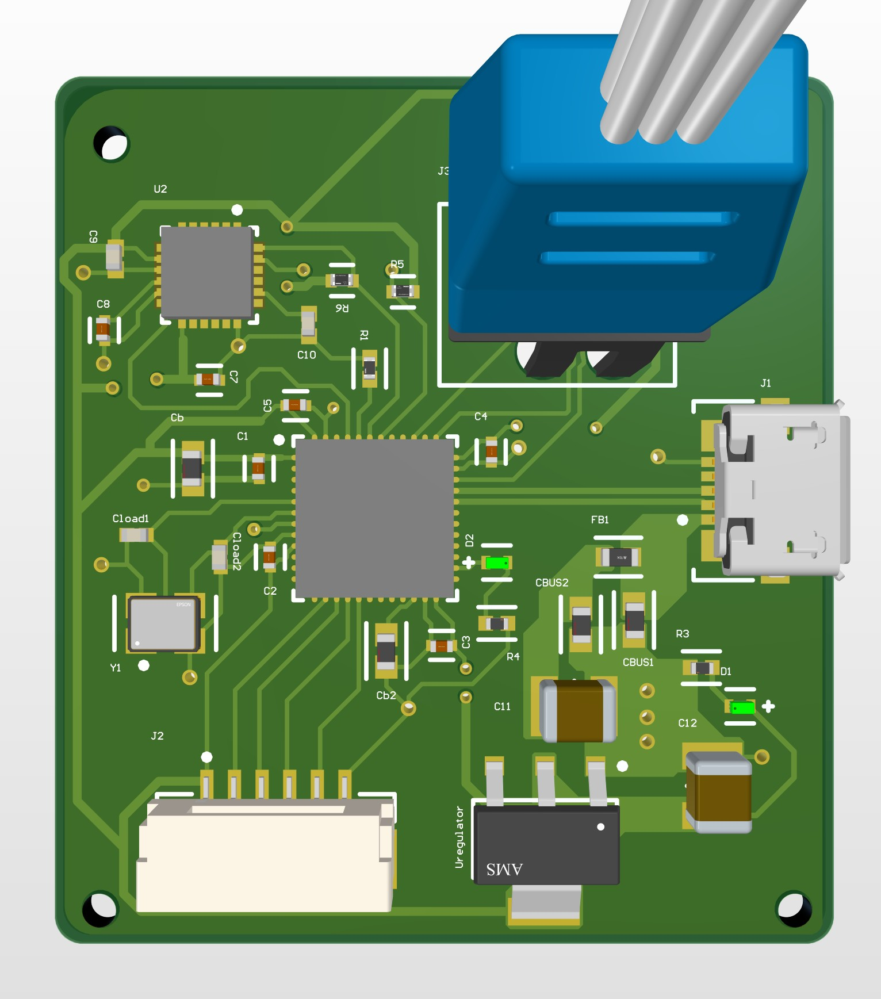
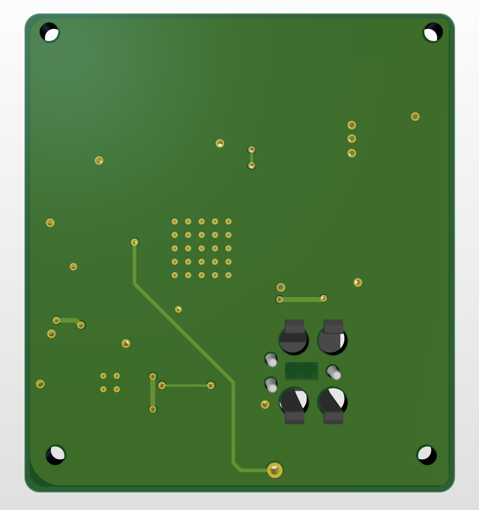

# Overview
This is a board designed by following a tutorial from Phil's Lab on YouTube. It uses a STM32 microcontroller and the popular MPU-6050 inertial measurement unit (IMU). Powered via USB-C connected to an LDO, along with a differential USB trace to the MCU. I have routed it slightly differently from Phil but overall it's almost identical.
Video by Phil's Lab: https://www.youtube.com/watch?v=PMEpQZ90f34&t=9901s
&nbsp;
 

# Key features
- 5V Power and differential trace via USB-C
- Power filtered and converted to 3.3V to power components via LDO
- 3 axis IMU
- serial wire debug
- 4 layer board with 2 internal ground planes for extra shielding from EMI
